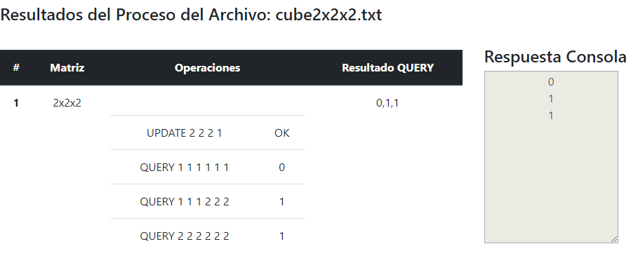
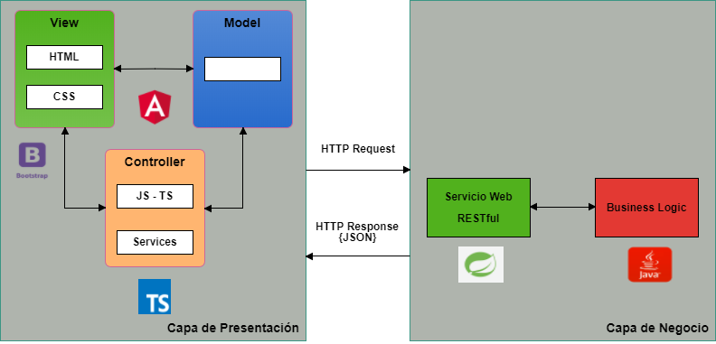

# Tabla de Contenido

* **[Problema](#problema)**<br>
* **[Solución](#soluci%C3%B3n)**<br>
* **[Capa Aplicación](#capa-aplicaci%C3%B3n)**<br>
* **[Responsabilidades](#responsabilidades)**<br>

# Problema

Resolver el siguiente problema de hackerank: 
<br>[Cube Summation](https://www.hackerrank.com/challenges/cube-summation/problem). 

You are given a 3-D Matrix in which each block contains 0 initially. The first block is defined by the coordinate (1,1,1) and the last block is defined by the coordinate (N,N,N). There are two types of queries.
```
UPDATE x y z W
```
updates the value of block (x,y,z) to W.
```
QUERY x1 y1 z1 x2 y2 z2
```
calculates the sum of the value of blocks whose x coordinate is between x1 and x2 (inclusive), y coordinate between y1 and y2 (inclusive) and z coordinate between z1 and z2 (inclusive).

<strong>Input Format</strong>
The first line contains an integer T, the number of test-cases. T testcases follow. 
For each test case, the first line will contain two integers N and M separated by a single space. 
N defines the N * N * N matrix. 
M defines the number of operations. 
The next M lines will contain either
```
 1. UPDATE x y z W
 2. QUERY  x1 y1 z1 x2 y2 z2 
```
<strong>Output Format</strong>
Print the result for each QUERY.

#### Sample Input
```
2
4 5
UPDATE 2 2 2 4
QUERY 1 1 1 3 3 3
UPDATE 1 1 1 23
QUERY 2 2 2 4 4 4
QUERY 1 1 1 3 3 3
2 4
UPDATE 2 2 2 1
QUERY 1 1 1 1 1 1
QUERY 1 1 1 2 2 2
QUERY 2 2 2 2 2 2
```
#### Sample Output
```
4
4
27
0
1
1
```
# Solución

*	Se implementa un componente de angular para recibir un archivo de texto plano mediante drag and drop.

*	Se realiza una petición HTTP Request POST mediante el HTTPClientModule de Angular para consumir un recurso expuesto por la capa de negocio.
Se envía el archivo recibido por el componente.

*	Se crea RESTful web service con Spring REST para procesar el archivo enviado por angular. Se genera un HTTP Response en formato JSON con los resultados
del proceso del archivo.

*	El mecanismo escogido para la entrada es un archivo plano con los datos de los test cases a ejecutar.

		```
		1
		2 4
		UPDATE 2 2 2 1
		QUERY 1 1 1 1 1 1
		QUERY 1 1 1 2 2 2
		QUERY 2 2 2 2 2 2
		```


*	El mecanismo escogido para la salida está compuesto por una tabla donde se visualiza el resultado de cada operación, y una consola donde se visualiza
el output de las operaciones QUERY aplicadas en los distintos test cases cargados en el archivo plano.



# Capa Aplicacion



# Responsabilidades

### Capa Presentación

*	<strong>cargar-archivo.component.html:</strong>  Vista del componente encargada de cargar el archivo y mostrar los resultados de la ejecución del proceso.
*	<strong>cargar-archivo.component.ts:</strong>  Controlador del componente que se subscribe al servicio para recibir los datos procesados.
*	<strong>send-file.service.ts:</strong>  Servicio que realiza HTTP Request - POST para consumir el recurso expuesto por el server para procesar el archivo plano con la entrada del problema **cube-summation** a solucionar. Retorna un Observable al controlador.

### Capa Negocio/Servicio

#### CubeController

Clase responsable de exponer el RESTful web service encargado de recibir el archivo con el problema a procesar, y generar un response en formato JSON con los resultados del proceso de los test cases recibidos. Tiene una inyección de dependencia con la interfaz del servicio **CubeService**.

###### **Request Info**

  + **Http Method:** POST
  + **URI:**  ````http://localhost:9999/cube/upload````
  + **Content-Type:** text/plain
  + **Headers:**  multipart/form-data
  + **Request PayLoad:**  Content-Type: text/plain

###### Response Info

  + **Entity Body:**
  ```json
 {
    "lstCases": [
        {
            "matrixN": 2,
            "operations": [
                {
                    "operation": "UPDATE 2 2 2 1",
                    "result": "OK",
                    "status": 200,
                    "type": "UPDATE"
                },
                {
                    "operation": "QUERY 1 1 1 1 1 1",
                    "result": "0",
                    "status": 200,
                    "type": "QUERY"
                },
                {
                    "operation": "QUERY 1 1 1 2 2 2",
                    "result": "1",
                    "status": 200,
                    "type": "QUERY"
                },
                {
                    "operation": "QUERY 2 2 2 2 2 2",
                    "result": "1",
                    "status": 200,
                    "type": "QUERY"
                }
            ],
            "result": [
                0,
                1,
                1
            ],
            "status": 200
        }
    ],
    "lstResults": [
        0,
        1,
        1
    ],
    "msg": "El archivo ha sido procesado exitosamente.",
    "status": 200
}
  ```


#### CubeService

Interfaz con el rol de servicio responsable de procesar la lógica del negocio. En este caso, de resolver el problema **cube-summation** expuestos en los test cases recibidos. Para ello, se apoya de la clase ContextCubeStrategy.

#### ContextCubeStrategy

Clase responsable de ejecutar la estrategia concreate a procesar dependiendo de la operación enviada en cada test case. (QUERY o UPDATE). Si la operación es QUERY, procesará la operación mediante la clase QueryCubeStrategy. Si la operación es UPDATE, procesará la operación mediante la clase UpdateCubeStrategy.

#### CubeStrategy

Declara una interfaz común para todos las operaciones UPDATE-QUERY. Esta interfaz será usada por el contexto para invocar a la estrategia concreta.

#### QueryCubeStrategy

Clase responsable de procesar las operaciones de tipo QUERY.

#### UpdateCubeStrategy

Clase responsable de procesar las operaciones de tipo UPDATE.

#### OperationDTO

DTO con scope prototype que tiene asociado los atributos relacionados a la operación a ejecutar.

#### CubeDTO

DTO con scope prototype que tiene asociado los atributos relacionados a la Matriz 3-D. Contiene una lista de operaciones OperationDTO.

#### CubeTestCasesDTO

DTO con scope prototype que tiene asociado los n-test cases recibidos en el problema. Cada Test Case es un objeto de tipo CubeDTO.